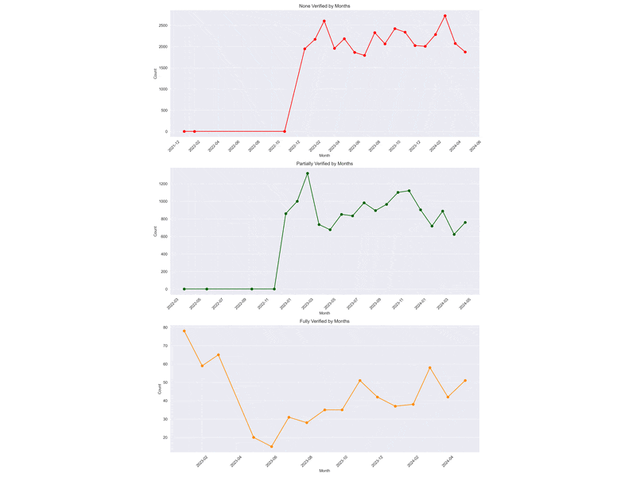

# Assessing Verisk Accuracy for Insurance Verification

## Objective
This project evaluates the accuracy of Verisk’s insurance verification process by comparing database records with XML responses. The goal was to replicate Verisk's validation rules using Python, analyze trends in verification outcomes, and identify recurring patterns in data to assess whether Verisk's services meet the required standards.

---

## Background
As an analyst I was tasked to analyze the effectiveness of Verisk's insurance verification is critical. The initial hypothesis suggested that Verisk achieves a ~5% full verification success rate, with partial verifications at ~30%. This project aims to determine the true accuracy of Verisk by systematically evaluating its verification process using a set of well-defined rules.

---

## Approach

### 1. Data Extraction
- Queried the **CONSUMER_LOS** database to extract relevant contract information.
- Parsed Verisk's XML responses to retrieve policy details.

### 2. Rule Implementation
Replicated Verisk's business validation rules in Python:
- **Policy Validity**: Ensured the `Policy` tag exists and contains valid data.
- **VIN Matching**: Verified that the VIN on the policy matches the VIN on the contract.
- **Lienholder Validation**:
  - Checked that the lienholder is listed as United Auto Credit or variations (UACC).
  - Ensured the lienholder address matches the required address.
- **Deductible Limits**: Validated that `CollisionDeductibleAmount` and `ComprehensiveDeductibleAmount` do not exceed $1,000.
- **Applicant Validation**:
  - Confirmed applicants and co-applicants are included in the policy.
  - Ensured neither is listed as an excluded driver.
- **Policy Term**: Verified that the policy term is at least six months.

### 3. Analysis
- Evaluated verification outcomes (`full`, `partial`, or `none`) for each contract.
- Analyzed trends over specific time periods to identify periods of high or low verification success.
- Identified recurring insurance providers associated with specific verification outcomes.

---

## Results

### 1. Overall Accuracy
- Quantified Verisk’s true accuracy rates for both full and partial verifications.

### 2. Trends Over Time
- Highlighted periods with higher verification success rates.

### 3. Recurring Providers
- Pinpointed insurance providers frequently appearing in both successful and unsuccessful verifications.

---

## Visualization

---

## Key Technologies

- **Languages**: Python, SQL
- **Libraries**: `pandas`, `xml.etree.ElementTree`, `matplotlib` , `seaborn`
- **Tools**: SQL Server, Python scripting, Jupyter Notebook
